# MediRecords — Clinical EMR Platform


End-to-end clinical record-keeping system covering patient registration, appointments, encounter charting (SOAP notes, vitals, nursing notes), orders (lab, imaging, prescriptions), billing (charges, unbilled queue), reports, and document management.

The platform serves **five role personas** — Admin, FrontDesk, Physician, Nurse, LabTech — each with a tailored workspace and explicit backend authorization.

---

## Table of Contents

1. [Tech Stack](#tech-stack)
2. [High-Level Architecture](#high-level-architecture)
3. [Project Layout](#project-layout)
4. [Authentication & Authorization Flow](#authentication--authorization-flow)
5. [Role-Based Routing & Landing Dashboards](#role-based-routing--landing-dashboards)
6. [End-to-End Patient Journey](#end-to-end-patient-journey)
7. [Appointment → Encounter Flow](#appointment--encounter-flow)
8. [Physician Workspace & Chart Actions](#physician-workspace--chart-actions)
9. [Prescription Create + Auto-Merge](#prescription-create--auto-merge)
10. [Care Plan Create + Auto-Merge](#care-plan-create--auto-merge)
11. [Billing & Charges Flow](#billing--charges-flow)
12. [Backend Request Lifecycle](#backend-request-lifecycle)
13. [Domain Model (Key Entities)](#domain-model-key-entities)
14. [API Surface Summary](#api-surface-summary)
15. [Running Locally](#running-locally)

---

## Tech Stack

| Layer | Stack |
|-------|-------|
| **Backend** | ASP.NET Core (.NET 10), EF Core, SQL Server, JWT auth, AutoMapper, Swagger |
| **Frontend** | Angular 18 (standalone components, signals), Reactive Forms, Bootstrap 5 |
| **Auth** | JWT bearer tokens with role claims |
| **Persistence** | SQL Server (`MediRecordsTestDB`) |

---

## High-Level Architecture

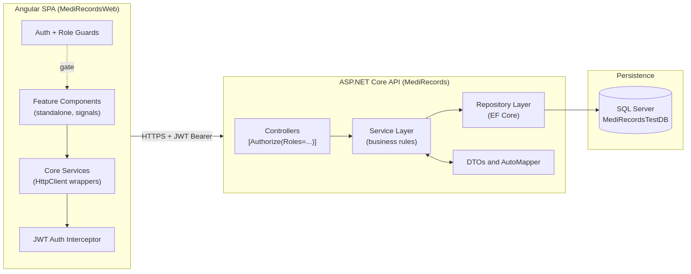

---

## Project Layout

```
MediRecords-Backend-main/
├── MediRecords/                  # ASP.NET Core API
│   ├── Controllers/              # 24 controllers, one per resource
│   ├── Services/                 # Per-resource service folders (business rules)
│   ├── Repository/               # Per-resource repository folders (EF Core)
│   ├── Dto/                      # Request / Response DTOs
│   ├── MappingProfiles/          # AutoMapper profiles
│   ├── Migrations/               # EF Core migrations
│   ├── Utility/                  # Constant.cs, Token helpers, EmailHelper
│   └── Program.cs                # DI registration + JWT + CORS + pipeline
│
├── MediRecords.Domain/           # Pure POCOs (no EF dependencies leak)
│   ├── Entities/                 # DbContext + entity classes
│   └── Enums/                    # UserRoleEnums, AppointmentStatus, …
│
└── MediRecordsWeb/               # Angular SPA
    └── src/app/
        ├── core/
        │   ├── guards/           # authGuard, roleGuard
        │   ├── interceptors/     # auth.interceptor.ts (attaches Bearer token)
        │   ├── models/           # TS interfaces matching backend DTOs
        │   └── services/         # 25+ HttpClient services
        ├── features/             # One folder per route page
        │   ├── auth/             # login, update-password
        │   ├── workspace/        # Physician dashboard
        │   ├── patients/         # Patient registry
        │   ├── appointments/
        │   ├── soap-notes/ vitals/ nursing-notes/ …
        │   └── admin/            # Admin-only: users, billing, reports, codes
        └── shared/components/    # SearchableSelectComponent, skeleton, etc.
```

---

## Authentication & Authorization Flow

The interceptor attaches the JWT to every request, the auth guard blocks unauthenticated routes, and the role guard enforces role-specific routes (e.g. `/admin/*` is Admin-only).

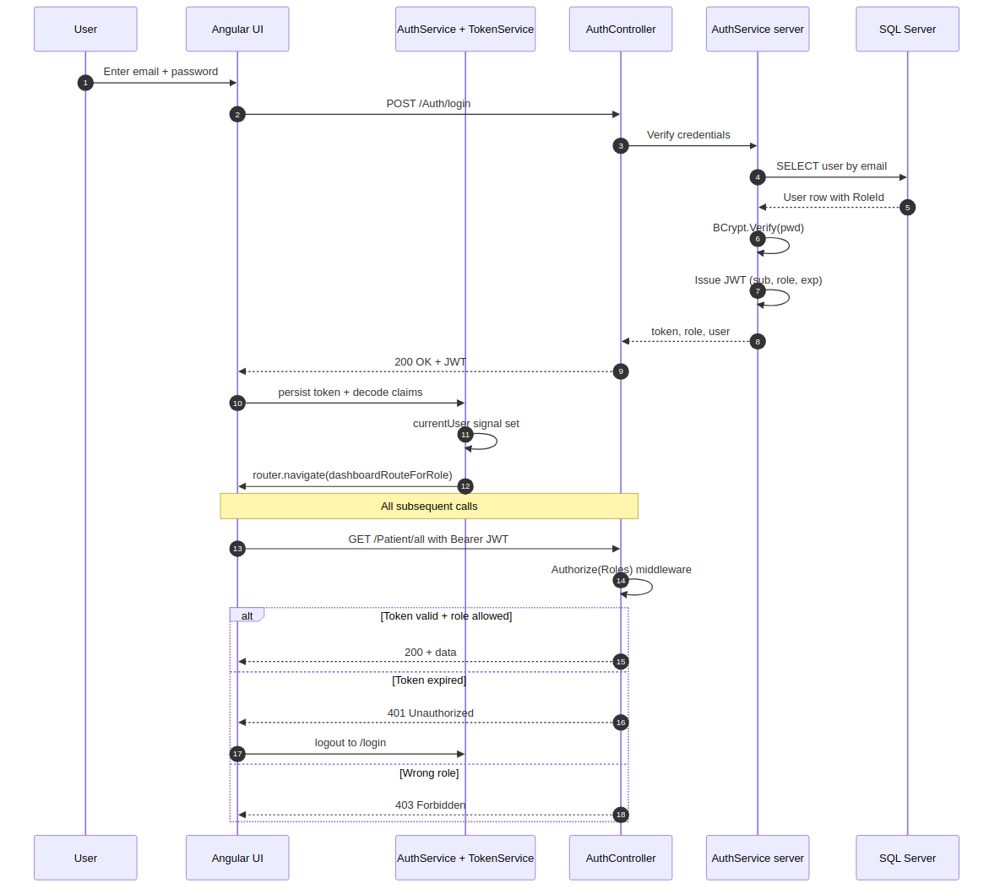

### Five-Role Authorization Matrix

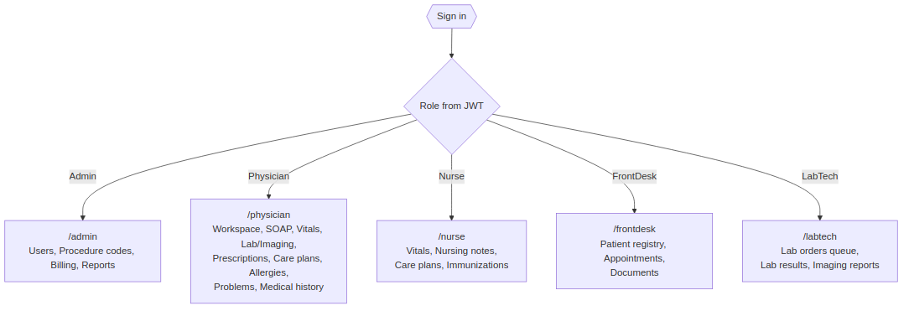

---

## Role-Based Routing & Landing Dashboards

Routes are declared in `src/app/app.routes.ts`. Each lazy-loaded component is wrapped by `authGuard` (rejects no-token) and optionally `roleGuard([…allowed roles])`.

| Role | Route | Access |
|------|-------|--------|
| **Admin** | `/admin` | Users · Procedure codes · Billing · Reports |
| **Physician** | `/physician` | Workspace · SOAP · Vitals · Lab/Imaging orders · Rx · Care plans · Allergies · Problems · Medical history |
| **Nurse** | `/nurse` | Vitals · Nursing notes · Care plans · Immunizations |
| **FrontDesk** | `/frontdesk` | Patient registry · Appointments · Documents |
| **LabTech** | `/labtech` | Lab orders queue · Lab results · Imaging reports |

---

## End-to-End Patient Journey

The platform is structured around this clinical lifecycle:

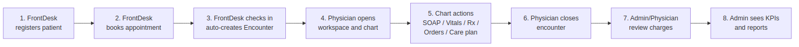

---

## Appointment → Encounter Flow

When FrontDesk flips an appointment status to `CheckedIn`, the server atomically creates an `Encounter` row in the same `SaveChangesAsync` call. The new encounter id flows back so the Physician (if the appointment's provider) can open the chart immediately.

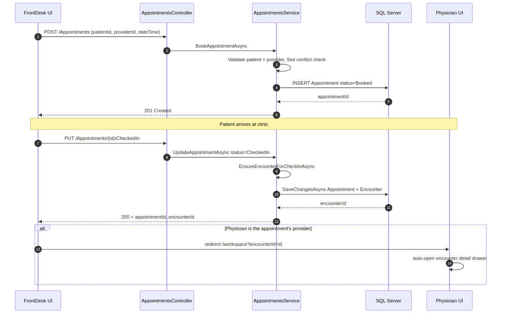

---

## Physician Workspace & Chart Actions

The workspace lists the physician's encounters for a chosen day. Clicking a card opens a drawer with status controls **and a 9-button "Chart actions" grid** that deep-links into each encounter-scoped feature with `?encounterId=X&patientName=Y` query params. Target pages lock the encounter (banner instead of dropdown) so the physician can't accidentally chart against a different one.

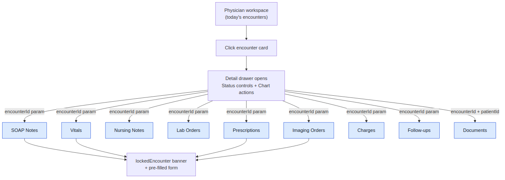

---

## Prescription Create + Auto-Merge

A subtle but important rule: when a physician creates a new prescription for an encounter that **already has one**, the new items get merged into the existing prescription via the UPDATE endpoint instead of creating a duplicate.

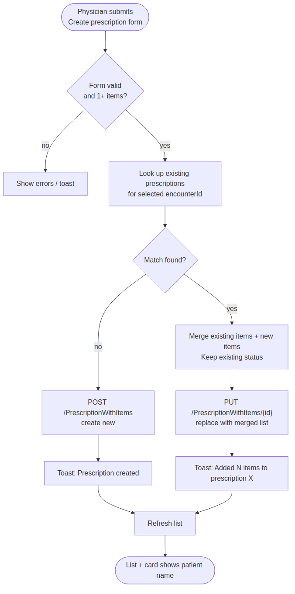

---

## Care Plan Create + Auto-Merge

Same idea on the backend: when a new care plan POST comes in for a patient with an **existing Active** care plan, the service appends the new goals (case-insensitive dedupe) and instructions onto the existing row instead of inserting a duplicate.

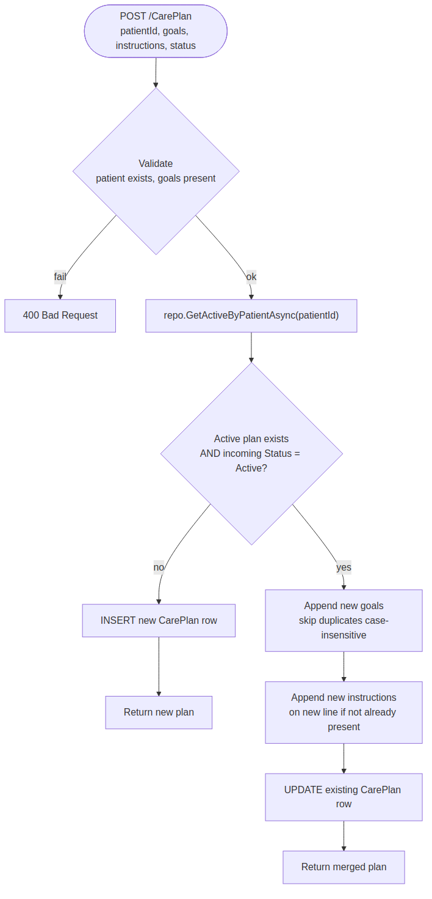

---

## Billing & Charges Flow

Visit charges are attached to encounters by Physicians; Admins review the **Unbilled queue**, mark batches as billed, and export CSV/JSON.

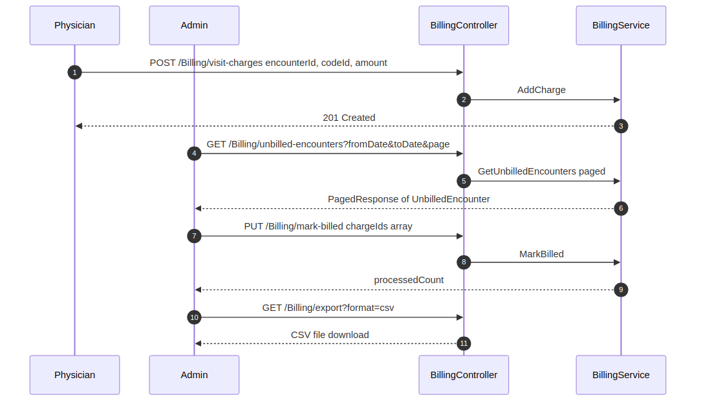

---

## Backend Request Lifecycle

Every API call traverses the same pipeline. Cross-cutting concerns (auth, validation, error translation) live in the middleware/controller layer; pure business rules live in the service layer; persistence lives in the repository layer.

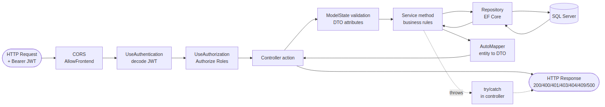

---

## Domain Model (Key Entities)

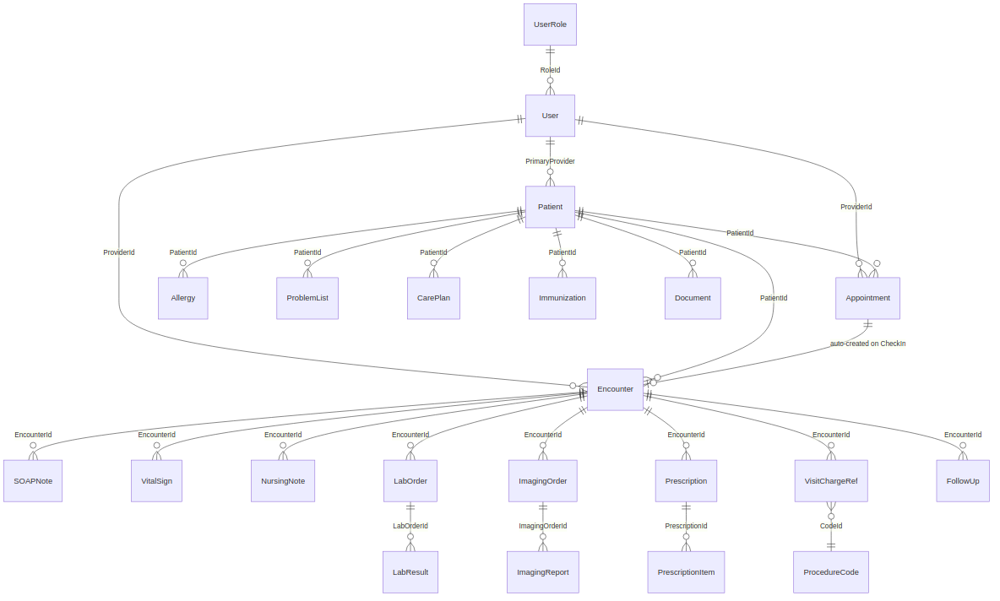

### Status Enums at a Glance

| Entity | Enum |
|--------|------|
| Appointment | `Booked`, `CheckedIn`, `Completed`, `Cancelled`, `NoShow` |
| Encounter | `Open(1)`, `Closed(2)`, `Locked(3)` |
| Patient | `Inactive(0)`, `Active(1)`, `Deceased(2)` |
| Prescription | `Draft`, `Issued` |
| CarePlan | `Active(false)`, `Completed(true)` |
| User | `Active(true)` / `Inactive(false)` |

---

## API Surface Summary

All endpoints are under `/api/v1/{Controller}`. Authorization is enforced per-action.

| Controller | Notable Endpoints | Roles |
|------------|-------------------|-------|
| **Auth** | `POST /login`, `POST /User/forgotpassword` | Public |
| **User** | `GET /GetAll`, `GET /providers`, `GET /roles`, `POST /register`, `PUT /update`, `POST /delete/{id}` | Admin / mixed |
| **Patient** | `GET /all`, `GET /{id}`, `POST /`, `PUT /{id}` | FrontDesk + clinical roles |
| **Encounter** | `GET /workspace?date=`, `GET /all`, `GET /{id}`, `PATCH /{id}/status` | Physician, Nurse, FrontDesk, Admin |
| **Appointments** | `GET /`, `POST /`, `PUT /{id}/{status}` | FrontDesk to book; all to read |
| **SOAPNote** | `POST /soap` | Physician |
| **VitalSign** | `POST /capture` | Authenticated |
| **NursingNote** | `POST /`, `PUT /{id}` | Authenticated |
| **LabOrder / LabResult** | `GET`, `POST`, status updates | Physician + LabTech |
| **ImagingOrder / Report** | `GET`, `POST` | Physician (orders), LabTech (reports) |
| **PrescriptionWithItems** | `GET`, `POST`, `PUT /{id}`, `DELETE /{id}` | Physician (full), Admin (delete) |
| **CarePlan** | `GET`, `POST` *(auto-merges into Active)* | Physician (create), Nurse (read) |
| **Billing** | `GET /unbilled-encounters`, `POST /visit-charges`, `PUT /visit-charges/{id}`, `PUT /mark-billed`, `GET /export` | Physician + Admin |
| **Reports** | `GET /clinic-kpis`, `GET /documentation-completeness`, `GET /no-show-cancellation`, `GET /provider-utilization` | Admin |
| **Document** | `POST` (upload), `GET` (search/download), `PUT`, `DELETE` | Admin, Physician, Nurse, FrontDesk |
| **Allergy / Problem / MedicalHistory / Immunization** | Per-patient CRUD | Physician (+ Nurse for some) |
| **FollowUp** | `GET`, `POST` | Physician |
| **ProcedureCode** | `GET`, `POST`, `PUT` | Admin |
| **ProviderProductivity** | Reporting endpoints | Admin |

### Reusable Lookup Endpoints (Frontend Dropdowns)

| Endpoint | Returns | Roles |
|----------|---------|-------|
| `GET /Patient/all` | `PatientLookupDto[]` (id, name, MRN, DOB, …) | FrontDesk, Physician, Nurse, Admin |
| `GET /Encounter/all` | `EncounterLookupDto[]` (id, patient, date, …) | Physician, Nurse, FrontDesk, Admin |
| `GET /User/providers` | `ProviderLookupDto[]` (id, name) — Physicians only | Physician, FrontDesk, Admin |

The frontend wraps these in the **`<app-searchable-select>`** component for type-ahead filtering across all 26 dropdown locations.

---

## Running Locally

### Prerequisites

- .NET 10 SDK
- Node.js 20+ and npm
- SQL Server (LocalDB or full instance)

### Backend

```bash
cd MediRecords
# 1. Update appsettings.json → ConnectionStrings:DefaultConnection
# 2. Apply migrations
dotnet ef database update
# 3. Run the API (defaults to https://localhost:5157)
dotnet run
```

Swagger UI is available at `https://localhost:5157/swagger` in Development.

### Frontend

```bash
cd MediRecordsWeb
npm install
npm start          # → http://localhost:4200
```

The Angular `environments/environment.ts` points `apiBaseUrl` at the backend. CORS in `Program.cs` is preconfigured to allow `http://localhost:4200`.

### First Login

After running migrations + seeding (or manually inserting roles `Admin / Physician / Nurse / LabTech / FrontDesk` into `UserRole` and at least one `User` row with a BCrypt-hashed password), navigate to `/login` and sign in. The frontend's role guard will redirect you to the appropriate dashboard.
