# MediRecords — Clinical EMR Platform

End-to-end clinical record-keeping system covering patient registration, appointments, encounter charting (SOAP notes, vitals, nursing notes), orders (lab, imaging, prescriptions), billing (charges, unbilled queue), reports, and document management.

The platform serves **five role personas** — Admin, FrontDesk, Physician, Nurse, LabTech — each with a tailored workspace and explicit backend authorization.

---

## Table of contents

1. [Tech stack](#tech-stack)
2. [High-level architecture](#high-level-architecture)
3. [Project layout](#project-layout)
4. [Authentication & authorization flow](#authentication--authorization-flow)
5. [Role-based routing & landing dashboards](#role-based-routing--landing-dashboards)
6. [End-to-end patient journey](#end-to-end-patient-journey)
7. [Appointment → Encounter flow](#appointment--encounter-flow)
8. [Physician workspace & "Chart actions"](#physician-workspace--chart-actions)
9. [Prescription create + auto-merge](#prescription-create--auto-merge)
10. [Care plan create + auto-merge](#care-plan-create--auto-merge)
11. [Billing & charges flow](#billing--charges-flow)
12. [Backend request lifecycle](#backend-request-lifecycle)
13. [Domain model (key entities)](#domain-model-key-entities)
14. [API surface summary](#api-surface-summary)
15. [Running locally](#running-locally)

---

## Tech stack

| Layer       | Stack                                                                      |
| ----------- | -------------------------------------------------------------------------- |
| Backend     | ASP.NET Core (.NET 10), EF Core, SQL Server, JWT auth, AutoMapper, Swagger |
| Frontend    | Angular 18 (standalone components, signals), Reactive Forms, Bootstrap 5   |
| Auth        | JWT bearer tokens with role claims                                         |
| Persistence | SQL Server (`MediRecordsTestDB`)                                           |

---

## High-level architecture

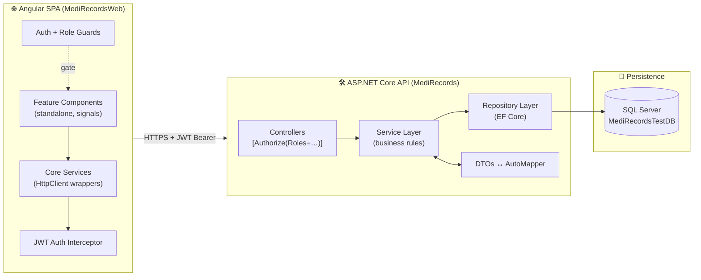

---

## Project layout

```
MediRecords-Backend-main/
├── MediRecords/                  # ASP.NET Core API
│   ├── Controllers/              # 24 controllers, one per resource
│   ├── Services/                 # Per-resource service folders (business rules)
│   ├── Repository/               # Per-resource repository folders (EF Core)
│   ├── Dto/                      # Request / Response DTOs
│   ├── MappingProfiles/          # AutoMapper profiles
│   ├── Migrations/               # EF Core migrations
│   ├── Utility/                  # Constant.cs, Token helpers, EmailHelper
│   └── Program.cs                # DI registration + JWT + CORS + pipeline
│
├── MediRecords.Domain/           # Pure POCOs (no EF dependencies leak)
│   ├── Entities/                 # DbContext + entity classes
│   └── Enums/                    # UserRoleEnums, AppointmentStatus, …
│
└── MediRecordsWeb/               # Angular SPA
    └── src/app/
        ├── core/
        │   ├── guards/           # authGuard, roleGuard
        │   ├── interceptors/     # auth.interceptor.ts (attaches Bearer token)
        │   ├── models/           # TS interfaces matching backend DTOs
        │   └── services/         # 25+ HttpClient services
        ├── features/             # One folder per route page
        │   ├── auth/             # login, update-password
        │   ├── workspace/        # Physician dashboard
        │   ├── patients/         # Patient registry
        │   ├── appointments/
        │   ├── soap-notes/ vitals/ nursing-notes/ …
        │   └── admin/            # Admin-only: users, billing, reports, codes
        └── shared/components/    # SearchableSelectComponent, skeleton, etc.
```

---

## Authentication & authorization flow

The interceptor attaches the JWT to every request, the auth guard blocks unauthenticated routes, and the role guard enforces role-specific routes (e.g. `/admin/*` is Admin-only).

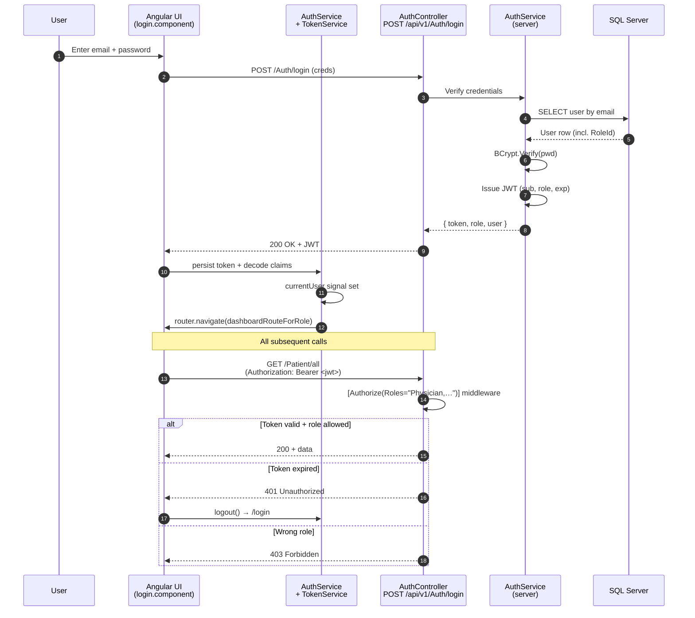

### Five-role authorization matrix

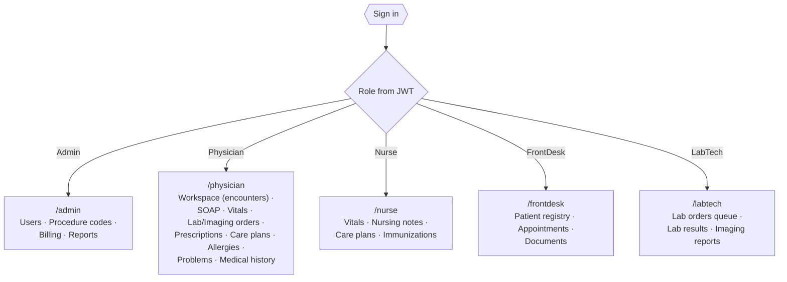

---

## Role-based routing & landing dashboards

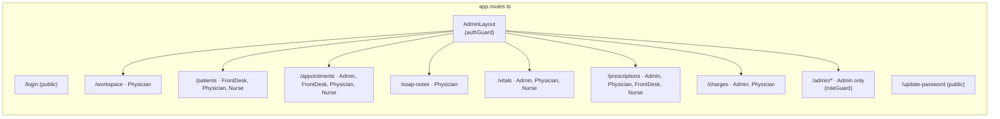

Routes are declared in [`src/app/app.routes.ts`](MediRecordsWeb/src/app/app.routes.ts). Each lazy-loaded component is wrapped by `authGuard` (rejects no-token) and optionally `roleGuard([…allowed roles])`.

---

## End-to-end patient journey

The platform is structured around this clinical lifecycle:

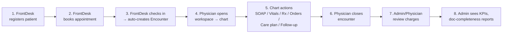

---

## Appointment → Encounter flow

When FrontDesk flips an appointment status to `CheckedIn`, the server atomically creates an `Encounter` row in the same `SaveChangesAsync` call. The new encounter id flows back so the Physician (if the appointment's provider) can open the chart immediately.

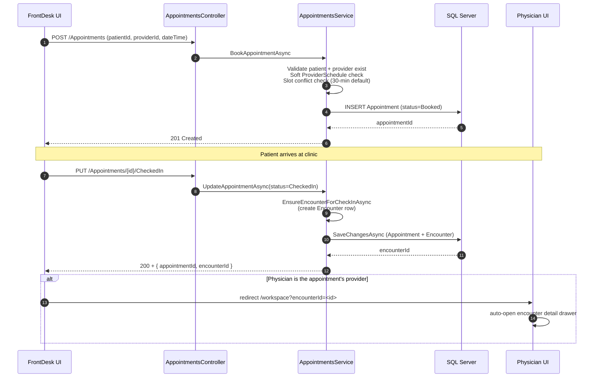

---

## Physician workspace & "Chart actions"

The workspace lists the physician's encounters for a chosen day. Clicking a card opens a drawer with status controls **and a 9-button "Chart actions" grid** that deep-links into each encounter-scoped feature with `?encounterId=X&patientName=Y` query params. Target pages lock the encounter (banner instead of dropdown) so the physician can't accidentally chart against a different one.

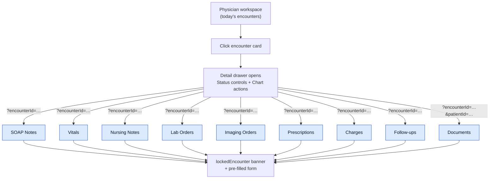

---

## Prescription create + auto-merge

A subtle but important rule: when a physician creates a new prescription for an encounter that **already has one**, the new items get merged into the existing prescription via the UPDATE endpoint instead of creating a duplicate.

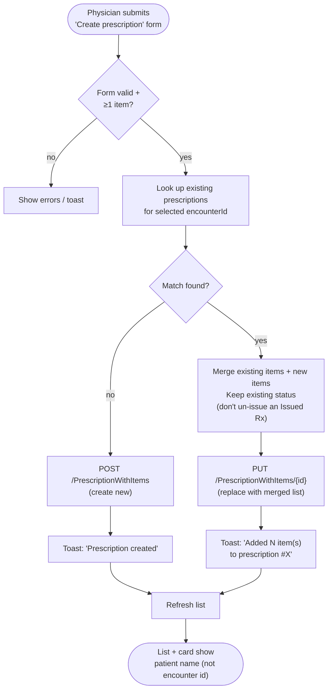

---

## Care plan create + auto-merge

Same idea on the backend: when a new care plan POST comes in for a patient with an **existing Active** care plan, the service appends the new goals (case-insensitive dedupe) and instructions onto the existing row instead of inserting a duplicate.

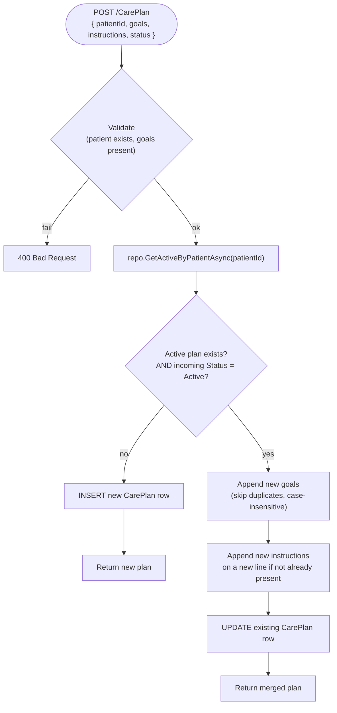

---

## Billing & charges flow

Visit charges are attached to encounters by Physicians; Admins review the **Unbilled queue**, mark batches as billed, and export CSV/JSON.

```mermaid
sequenceDiagram
  autonumber
  participant Phy as Physician
  participant Admin as Admin
  participant API as BillingController
  participant SVC as BillingService

  Phy->>API: POST /Billing/visit-charges<br/>(encounterId, codeId, amount)
  API->>SVC: AddCharge
  SVC-->>Phy: 201 Created

  Admin->>API: GET /Billing/unbilled-encounters<br/>?fromDate=…&toDate=…&providerId=…&page=…
  API->>SVC: GetUnbilledEncounters (paged)
  SVC-->>Admin: PagedResponse&lt;UnbilledEncounter&gt;

  Admin->>API: PUT /Billing/mark-billed (chargeIds[])
  API->>SVC: MarkBilled
  SVC-->>Admin: { processedCount }

  Admin->>API: GET /Billing/export?format=csv
  API-->>Admin: CSV file download
```

---

## Backend request lifecycle

Every API call traverses the same pipeline. Cross-cutting concerns (auth, validation, error translation) live in the middleware/controller layer; pure business rules live in the service layer; persistence lives in the repository layer.

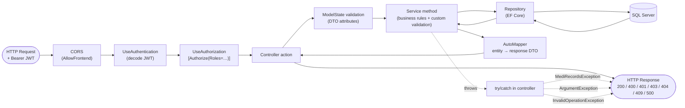

---

## Domain model (key entities)

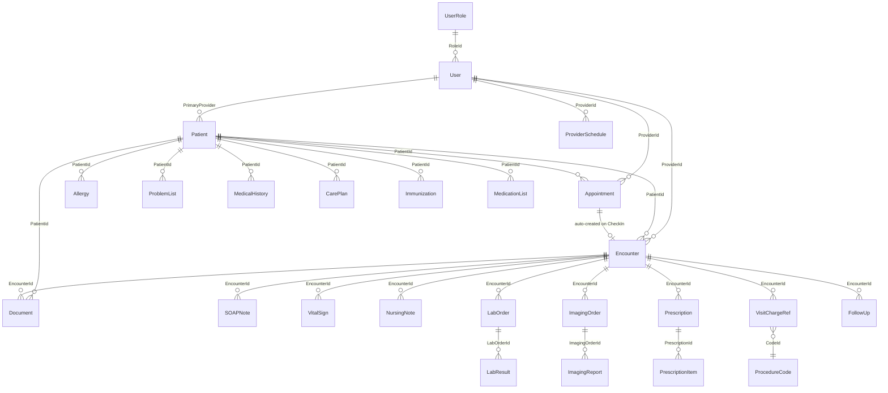

### Status enums at a glance

| Entity        | Enum                                            |
| ------------- | ----------------------------------------------- |
| Appointment   | `Booked, CheckedIn, Completed, Cancelled, NoShow` |
| Encounter     | `Open(1), Closed(2), Locked(3)`                 |
| Patient       | `Inactive(0), Active(1), Deceased(2)`           |
| Prescription  | `Draft, Issued`                                 |
| CarePlan      | `Active(false), Completed(true)`                |
| User          | `Active(true) / Inactive(false)`                |

---

## API surface summary

All endpoints are under `/api/v1/{Controller}`. Authorization is enforced per-action.

| Controller                  | Notable endpoints                                                                                | Roles                                |
| --------------------------- | ------------------------------------------------------------------------------------------------ | ------------------------------------ |
| **Auth**                    | `POST /login`, `POST /User/forgotpassword`                                                       | Public                               |
| **User**                    | `GET /GetAll`, `GET /providers`, `GET /roles`, `POST /register`, `PUT /update`, `POST /delete/{id}` | Admin / mixed                        |
| **Patient**                 | `GET /all`, `GET /{id}`, `POST /`, `PUT /{id}`                                                   | FrontDesk + clinical roles           |
| **Encounter**               | `GET /workspace?date=`, `GET /all`, `GET /{id}`, `PATCH /{id}/status`                            | Physician, Nurse, FrontDesk, Admin   |
| **Appointments**            | `GET /`, `POST /`, `PUT /{id}/{status}`                                                          | FrontDesk to book; all to read       |
| **SOAPNote**                | `POST /soap`                                                                                     | Physician                            |
| **VitalSign**               | `POST /capture`                                                                                  | Authenticated                        |
| **NursingNote**             | `POST /`, `PUT /{id}`                                                                            | Authenticated                        |
| **LabOrder / LabResult**    | `GET`, `POST`, status updates                                                                    | Physician + LabTech                  |
| **ImagingOrder / Report**   | `GET`, `POST`                                                                                    | Physician (orders), LabTech (reports) |
| **PrescriptionWithItems**   | `GET`, `POST`, `PUT /{id}`, `DELETE /{id}`                                                       | Physician (full), Admin (delete)     |
| **CarePlan**                | `GET`, `POST` *(auto-merges into Active)*                                                        | Physician (create), Nurse (read)     |
| **Billing**                 | `GET /unbilled-encounters`, `POST /visit-charges`, `PUT /visit-charges/{id}`, `PUT /mark-billed`, `GET /export` | Physician + Admin |
| **Reports**                 | `GET /clinic-kpis`, `GET /documentation-completeness`, `GET /no-show-cancellation`, `GET /provider-utilization` | Admin |
| **Document**                | `POST` (upload), `GET` (search/download), `PUT`, `DELETE`                                        | Admin, Physician, Nurse, FrontDesk   |
| **Allergy / Problem / MedicalHistory / Immunization** | per-patient CRUD                                                          | Physician (+ Nurse for some)         |
| **FollowUp**                | `GET`, `POST`                                                                                    | Physician                            |
| **ProcedureCode**           | `GET`, `POST`, `PUT`                                                                             | Admin                                |
| **ProviderProductivity**    | reporting endpoints                                                                              | Admin                                |

### Reusable lookup endpoints (used to power frontend dropdowns)

| Endpoint                       | Returns                                          | Roles                                |
| ------------------------------ | ------------------------------------------------ | ------------------------------------ |
| `GET /Patient/all`             | `PatientLookupDto[]` (id, name, MRN, DOB, …)     | FrontDesk, Physician, Nurse, Admin   |
| `GET /Encounter/all`           | `EncounterLookupDto[]` (id, patient, date, …)    | Physician, Nurse, FrontDesk, Admin   |
| `GET /User/providers`          | `ProviderLookupDto[]` (id, name) — Physicians only | Physician, FrontDesk, Admin       |

The frontend wraps these in the **`<app-searchable-select>`** component for type-ahead filtering across all 26 dropdown locations.

---

## Running locally

### Prerequisites

- .NET 10 SDK
- Node.js 20+ and npm
- SQL Server (LocalDB or full instance)

### Backend

```bash
cd MediRecords
# 1. Update appsettings.json → ConnectionStrings:DefaultConnection
# 2. Apply migrations
dotnet ef database update
# 3. Run the API (defaults to https://localhost:5157)
dotnet run
```

Swagger UI is available at `https://localhost:5157/swagger` in Development.

### Frontend

```bash
cd MediRecordsWeb
npm install
npm start          # → http://localhost:4200
```

The Angular `environments/environment.ts` points `apiBaseUrl` at the backend. CORS in [`Program.cs`](MediRecords/Program.cs) is preconfigured to allow `http://localhost:4200`.

### First login

After running migrations + seeding (or manually inserting roles `Admin / Physician / Nurse / LabTech / FrontDesk` into `UserRole` and at least one `User` row with a BCrypt-hashed password), navigate to `/login` and sign in. The frontend's role guard will redirect you to the appropriate dashboard.

---

## Notes on diagrams

All flowcharts in this README use **Mermaid**, which is rendered natively by:

- GitHub (in the README preview)
- GitLab
- VS Code (with the Markdown Preview Mermaid extension or built-in support)
- Most modern static site generators (Docusaurus, MkDocs, Jekyll with plugins)

To export any diagram as PNG/SVG: open the README in VS Code preview, right-click the rendered diagram, **or** paste the diagram source into [mermaid.live](https://mermaid.live) and download from there.
